<
- [High-Level Architecture](#high-level-architecture)
- [Frontend Architecture](#frontend-architecture)
- [Backend Architecture](#backend-architecture)
- [Database Design](#database-design)
- [Authentication Flow](#authentication-flow)
- [Request Lifecycle](#request-lifecycle)
- [Folder Structure](#folder-structure)
- [Design Patterns](#design-patterns)
- [Security Measures](#security-measures)

---

## System Overview

The Smart Task & Team Management Portal follows a **client-server architecture** built on the MERN stack. The frontend (React SPA) communicates with the backend (Express REST API) over HTTP, and the backend persists data in MongoDB Atlas (cloud-hosted).

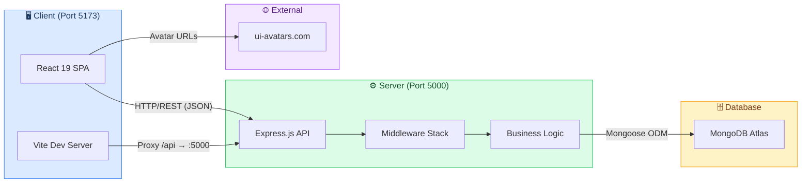

### Key Architecture Decisions

| Decision | Rationale |
|---|---|
| **Monorepo structure** | Single repository with root `package.json` orchestrating both apps via `concurrently` |
| **Vite proxy** | Frontend dev server proxies `/api` requests to backend, avoiding CORS issues in development |
| **JWT in httpOnly cookies** | Secure token storage that prevents XSS attacks; falls back to Authorization header for non-browser clients |
| **Mongoose ODM** | Schema-based modeling provides validation, middleware hooks, and virtuals for MongoDB |
| **Tailwind CSS** | Utility-first approach enables rapid UI development with consistent design tokens |

---

## High-Level Architecture

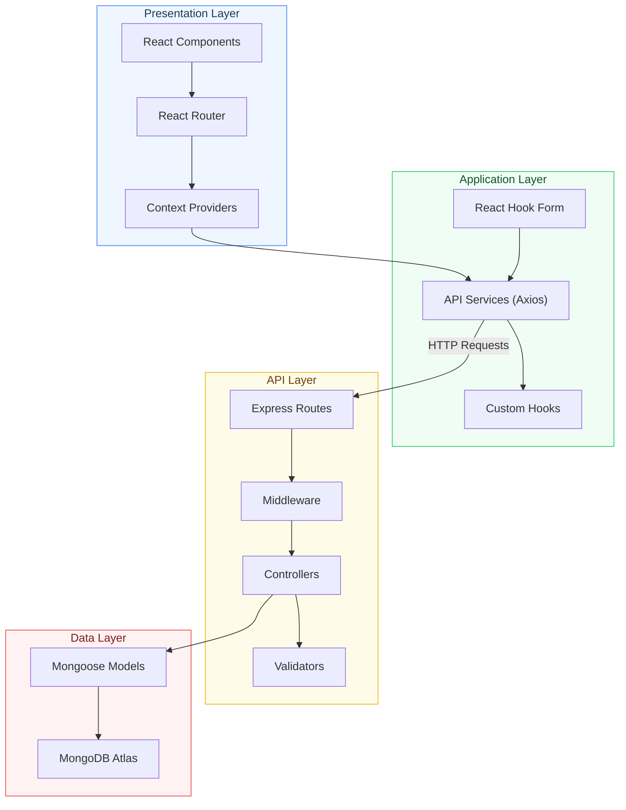

---

## Frontend Architecture

### Component Hierarchy

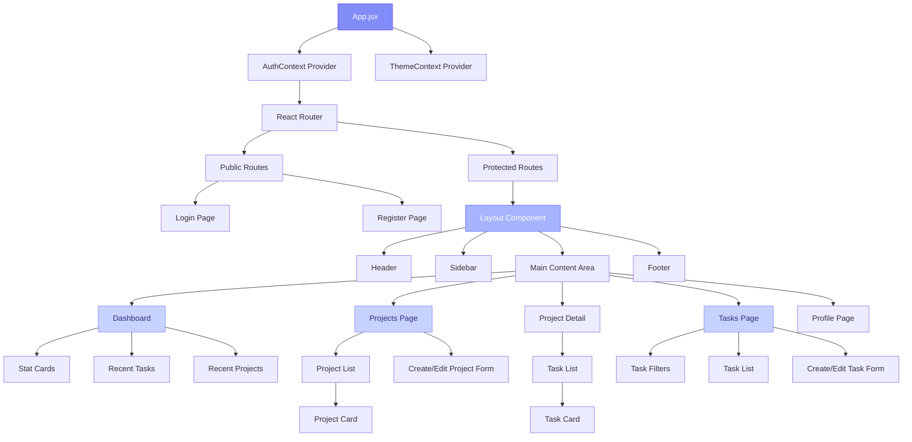

### Frontend Technology Map

| Layer | Technology | Responsibility |
|---|---|---|
| **UI Rendering** | React 19 | Component-based UI with hooks |
| **Routing** | React Router DOM 6 | Client-side navigation with protected routes |
| **State Management** | React Context API | Global auth state and theme state |
| **Forms** | React Hook Form | Performant form handling with validation |
| **HTTP Client** | Axios | API communication with interceptors |
| **Styling** | Tailwind CSS 3 | Utility-first CSS with custom theme |
| **Notifications** | React Hot Toast | User feedback and error messages |
| **Icons** | React Icons | Consistent iconography |
| **Build Tool** | Vite 5 | Fast HMR, build optimization, API proxy |

### State Management Strategy

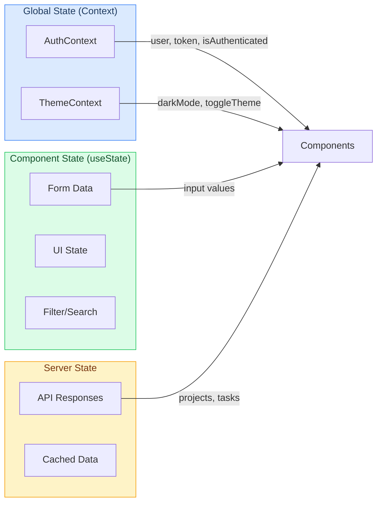

---

## Backend Architecture

### Request Processing Pipeline

```mermaid
graph LR
    Client["Client Request"] --> Express["Express Server"]
    Express --> Helmet["Helmet (Security Headers)"]
    Helmet --> CORS["CORS"]
    CORS --> RateLimit["Rate Limiter"]
    RateLimit --> Morgan["Morgan (Logger)"]
    Morgan --> CookieParser["Cookie Parser"]
    CookieParser --> JSONParser["JSON Body Parser"]
    JSONParser --> Router["Route Matcher"]

    Router -->|"/api/auth/*"| AuthRoutes["Auth Routes"]
    Router -->|"/api/projects/*"| ProjectRoutes["Project Routes"]
    Router -->|"/api/tasks/*"| TaskRoutes["Task Routes"]
    Router -->|"No match"| NotFound["404 Handler"]

    AuthRoutes --> AuthLimiter["Auth Rate Limiter"]
    AuthLimiter --> AuthMiddleware["Auth Middleware"]
    AuthMiddleware --> Validator["Request Validator"]
    Validator --> Controller["Controller"]

    ProjectRoutes --> AuthMiddleware2["Auth Middleware"]
    AuthMiddleware2 --> Controller2["Controller"]

    TaskRoutes --> AuthMiddleware3["Auth Middleware"]
    AuthMiddleware3 --> Controller3["Controller"]

    Controller --> Model["Mongoose Model"]
    Controller2 --> Model
    Controller3 --> Model
    Model --> MongoDB["MongoDB Atlas"]

    Controller -->|"Response"| ErrorHandler["Error Handler"]
    ErrorHandler --> Client

    style Client fill:#e0e7ff,stroke:#6366f1,color:#312e81
    style Express fill:#dcfce7,stroke:#22c55e,color:#14532d
    style MongoDB fill:#fef3c7,stroke:#f59e0b,color:#78350f
```

### Middleware Stack (in order)

| Order | Middleware | Purpose |
|---|---|---|
| 1 | `helmet()` | Sets secure HTTP response headers |
| 2 | `cors()` | Configures Cross-Origin Resource Sharing |
| 3 | `generalLimiter` | Rate limits all routes (100 req/15 min) |
| 4 | `morgan('dev')` | Logs HTTP requests in development |
| 5 | `cookieParser()` | Parses cookies from request headers |
| 6 | `express.json()` | Parses JSON request bodies |
| 7 | Route-specific `authLimiter` | Stricter rate limit for auth routes (20 req/15 min) |
| 8 | Route-specific `protect` | Verifies JWT and attaches user to request |
| 9 | `notFound` | Catches undefined routes → 404 |
| 10 | `errorHandler` | Global error handler → consistent JSON response |

---

## Database Design

### Entity-Relationship Diagram

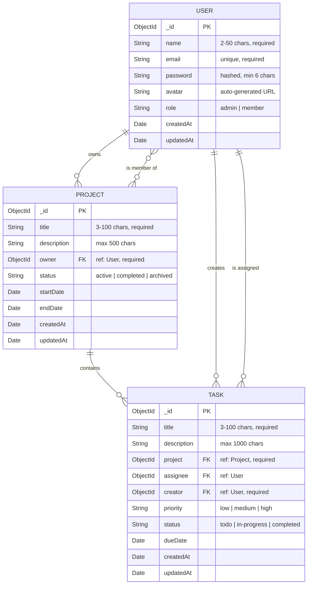

### Model Details

#### User Model

| Field | Type | Constraints | Notes |
|---|---|---|---|
| `name` | String | Required, 2–50 chars, trimmed | Used to generate avatar URL |
| `email` | String | Required, unique, lowercase, regex-validated | Used for login |
| `password` | String | Required, min 6 chars, `select: false` | Hashed with bcryptjs (12 rounds) |
| `avatar` | String | Auto-generated | Generated from `ui-avatars.com` on save |
| `role` | String | Enum: `admin`, `member` | Default: `member` |

**Pre-save Hooks:**
1. Auto-generates avatar URL from user's name via `ui-avatars.com`
2. Hashes password with bcryptjs (12 salt rounds) if modified

**Instance Methods:**
- `matchPassword(candidatePassword)` — Compares plain-text password against stored hash

#### Project Model

| Field | Type | Constraints | Notes |
|---|---|---|---|
| `title` | String | Required, 3–100 chars, trimmed | — |
| `description` | String | Max 500 chars, trimmed | Default: `""` |
| `owner` | ObjectId → User | Required | The user who created the project |
| `members` | ObjectId[] → User | — | Array of team member references |
| `status` | String | Enum: `active`, `completed`, `archived` | Default: `active` |
| `startDate` | Date | — | Optional project start date |
| `endDate` | Date | — | Optional project end date |

**Indexes:** `{ owner: 1 }`, `{ status: 1 }`, `{ owner: 1, status: 1 }`

**Virtuals:** `taskCount` — Count of tasks with matching `project` field

#### Task Model

| Field | Type | Constraints | Notes |
|---|---|---|---|
| `title` | String | Required, 3–100 chars, trimmed | — |
| `description` | String | Max 1000 chars, trimmed | Default: `""` |
| `project` | ObjectId → Project | Required | The project this task belongs to |
| `assignee` | ObjectId → User | — | The user assigned to complete the task |
| `creator` | ObjectId → User | Required | The user who created the task |
| `priority` | String | Enum: `low`, `medium`, `high` | Default: `medium` |
| `status` | String | Enum: `todo`, `in-progress`, `completed` | Default: `todo` |
| `dueDate` | Date | — | Optional deadline |

**Indexes:** `{ project: 1 }`, `{ assignee: 1 }`, `{ status: 1 }`, `{ priority: 1 }`, `{ project: 1, status: 1 }`, `{ assignee: 1, status: 1 }`

---

## Authentication Flow

### Registration Flow

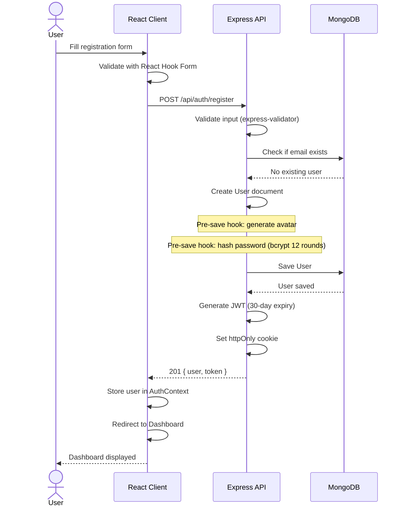

### Login Flow

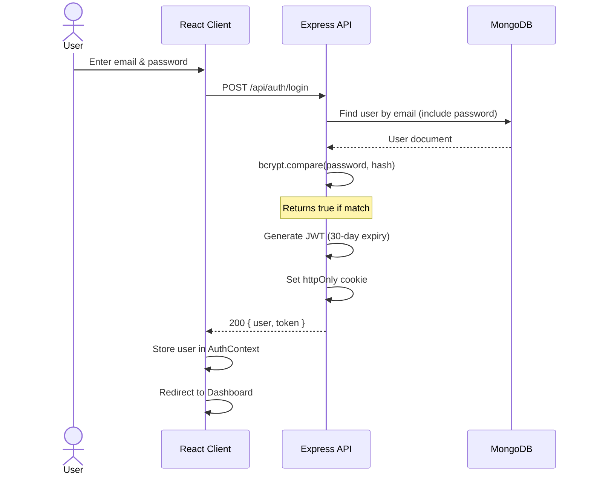

### Authenticated Request Flow

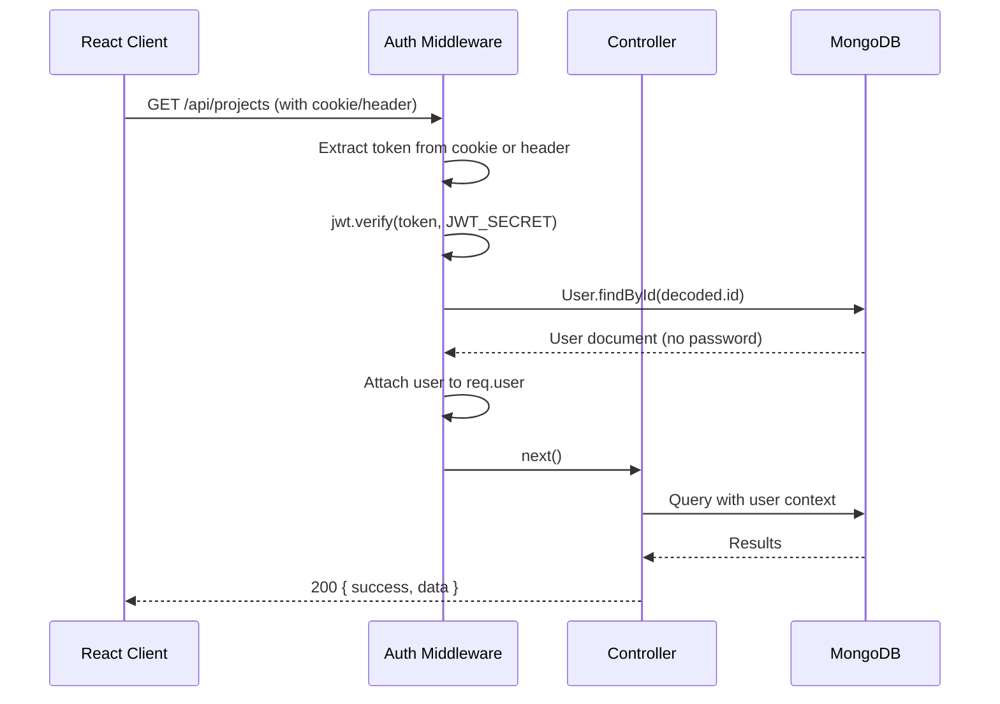

---

## Request Lifecycle

A typical API request passes through the following stages:

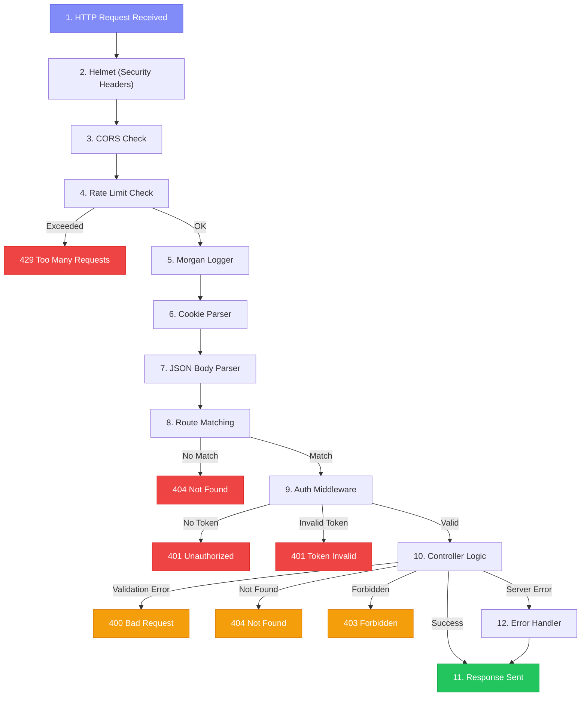

---

## Folder Structure

### Backend (`server/`)

```
server/
├── config/
│   └── db.js                    # MongoDB connection using Mongoose
│                                  - Reads MONGO_URI from env
│                                  - Logs connection status
│                                  - Exits process on failure
│
├── middleware/
│   ├── authMiddleware.js        # JWT verification guard
│   │                              - Checks cookies → then Authorization header
│   │                              - Verifies token and attaches req.user
│   │                              - Returns 401 on failure
│   │
│   ├── errorMiddleware.js       # Error handling
│   │                              - notFound: catches 404 for undefined routes
│   │                              - errorHandler: consistent JSON error responses
│   │                              - Stack trace only in development
│   │
│   └── rateLimiter.js           # Rate limiting
│                                  - generalLimiter: 100 req / 15 min (all routes)
│                                  - authLimiter: 20 req / 15 min (login/register)
│
├── models/
│   ├── User.js                  # User schema + password hashing + avatar generation
│   ├── Project.js               # Project schema + virtuals + indexes
│   └── Task.js                  # Task schema + indexes for query optimization
│
├── routes/                      # Express route definitions
│   ├── authRoutes.js            # /api/auth/*
│   ├── projectRoutes.js         # /api/projects/*
│   └── taskRoutes.js            # /api/tasks/*
│
├── controllers/                 # Business logic separated from routes
│   ├── authController.js        # register, login, logout, getProfile, updateProfile
│   ├── projectController.js     # CRUD operations for projects
│   └── taskController.js        # CRUD operations + stats for tasks
│
├── utils/
│   └── generateToken.js         # JWT creation + httpOnly cookie setter
│
├── server.js                    # Application entry point
│                                  - Loads env vars, connects DB
│                                  - Mounts middleware stack
│                                  - Mounts routes, starts listening
│
├── package.json                 # Server dependencies
└── .env                         # Environment variables (not committed)
```

### Frontend (`client/`)

```
client/
├── public/                      # Static assets served as-is
│
├── src/
│   ├── components/              # Reusable UI building blocks
│   │   ├── layout/              # Structural components (Header, Sidebar, Footer)
│   │   ├── auth/                # Authentication forms
│   │   ├── projects/            # Project-related components
│   │   ├── tasks/               # Task-related components
│   │   └── common/              # Shared components (Button, Modal, Loader, etc.)
│   │
│   ├── pages/                   # Route-level page components
│   │   ├── Dashboard.jsx        # Overview with stats and recent items
│   │   ├── Projects.jsx         # Project listing with CRUD
│   │   ├── ProjectDetail.jsx    # Single project with its tasks
│   │   ├── Tasks.jsx            # Task listing with filters
│   │   ├── Profile.jsx          # User profile management
│   │   ├── Login.jsx            # Login page
│   │   └── Register.jsx         # Registration page
│   │
│   ├── context/                 # React Context providers
│   │   ├── AuthContext.jsx      # Auth state: user, login, logout, register
│   │   └── ThemeContext.jsx     # Theme state: darkMode, toggle
│   │
│   ├── hooks/                   # Custom React hooks
│   ├── services/                # API service layer
│   │   └── api.js               # Axios instance with base URL and interceptors
│   │
│   ├── utils/                   # Helper/utility functions
│   ├── App.jsx                  # Root component with routing setup
│   ├── main.jsx                 # Entry point — renders App to DOM
│   └── index.css                # Tailwind directives (@tailwind base, etc.)
│
├── index.html                   # HTML shell
├── vite.config.js               # Vite config with API proxy to :5000
├── tailwind.config.js           # Tailwind theme with custom colors & animations
├── postcss.config.js            # PostCSS plugins (Tailwind + Autoprefixer)
└── package.json                 # Client dependencies
```

---

## Design Patterns

### Patterns Used

| Pattern | Where | Description |
|---|---|---|
| **MVC (Model-View-Controller)** | Backend | Models define data, Controllers handle logic, Routes map URLs |
| **Middleware Chain** | Backend | Express middleware pipeline for cross-cutting concerns |
| **Repository Pattern** | Models | Mongoose models abstract database operations |
| **Context Provider** | Frontend | React Context for global state (auth, theme) |
| **Container/Presentational** | Frontend | Pages (containers) manage state; Components render UI |
| **Service Layer** | Frontend | `services/api.js` centralizes all HTTP communication |
| **Hook Composition** | Frontend | Custom hooks encapsulate reusable logic |
| **Proxy Pattern** | Dev Setup | Vite proxies `/api` to backend, abstracting the server URL |
| **Factory Pattern** | Backend | `generateToken()` encapsulates JWT creation and cookie setup |
| **Observer Pattern** | Frontend | React state changes trigger re-renders automatically |

### Separation of Concerns

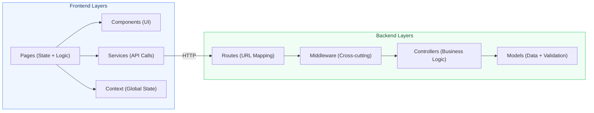

---

## Security Measures

### Defense-in-Depth Strategy

The application implements multiple layers of security:

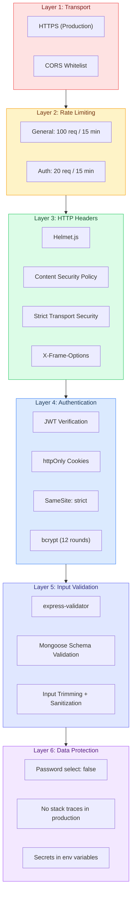

### Security Feature Summary

| Feature | Implementation | Threat Mitigated |
|---|---|---|
| **Password Hashing** | bcryptjs with 12 salt rounds | Password theft from database breach |
| **JWT httpOnly Cookies** | `httpOnly: true` flag on cookie | XSS-based token theft |
| **SameSite Cookies** | `sameSite: 'strict'` | Cross-Site Request Forgery (CSRF) |
| **Secure Cookies** | `secure: true` in production | Token interception over HTTP |
| **Helmet.js** | Default security headers | Various HTTP-level attacks |
| **CORS** | Whitelisted origins only | Unauthorized cross-origin requests |
| **Rate Limiting (General)** | 100 requests per 15 min per IP | DoS and abuse |
| **Rate Limiting (Auth)** | 20 requests per 15 min per IP | Brute-force login attempts |
| **Input Validation** | express-validator + Mongoose schemas | Injection attacks, invalid data |
| **Password Exclusion** | `select: false` on password field | Accidental password exposure in queries |
| **Error Sanitization** | Stack traces hidden in production | Information disclosure |
| **Environment Variables** | `.env` file for secrets | Hardcoded credentials in source code |

---

*Last updated: June 2024*
]]>
